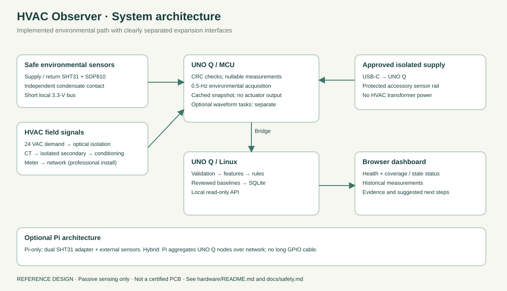
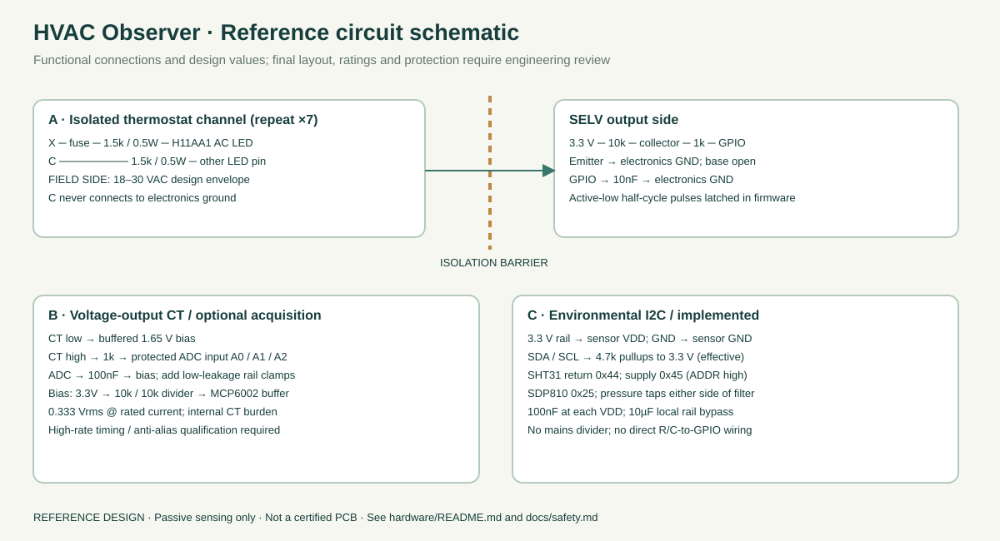
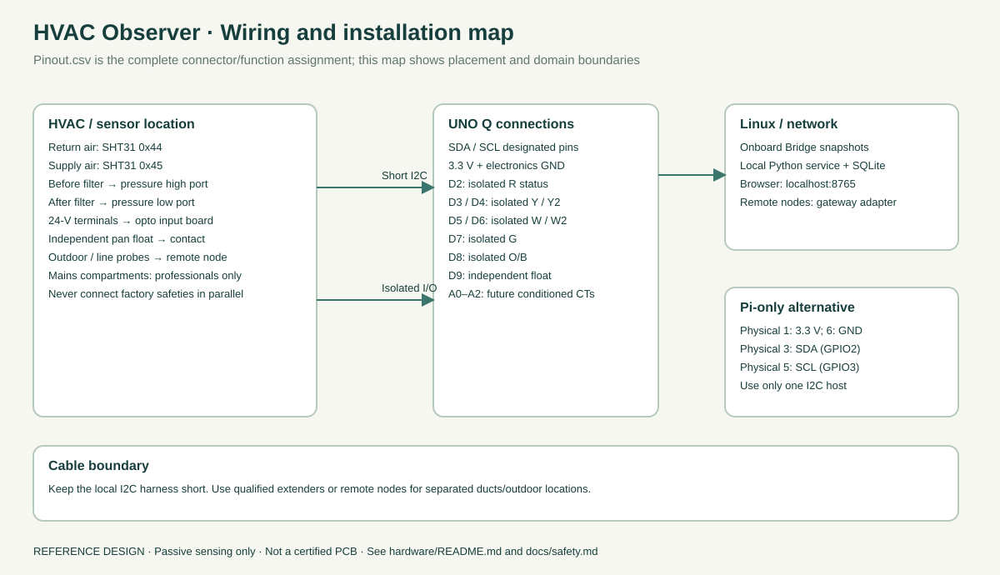

# Hardware reference

These are prototype reference drawings, not a construction-approved PCB. They contain no direct mains wiring. Read [safety](../docs/safety.md), [sensor matrix](sensors.md) and [pin map](pinout.csv). All quoted sensor accuracy is component accuracy under datasheet conditions; installed accuracy includes wiring, mounting and calibration errors.

The [editable KiCad project](kicad/README.md) contains the sensor interface, all seven isolated thermostat channels and the optional three-channel current front end. It includes CAD-generated previews, a netlist and a component inventory. KiCad 10.0.6 reported zero electrical-rule errors or warnings; hardware validation is still required.

## Power and enclosure

UNO Q: approved USB-C 5 V / 3 A supply; verify the board revision's requirements. Pi Zero alternative: its approved supply. No connection to HVAC R/C for power. Use a separate 3.3-V low-noise regulator from a protected 5-V accessory rail for expanded sensors, with its ground joined to MCU GND at one low-voltage star point. Do not backfeed board 3.3 V. Breakouts must have 3.3-V logic pullups.

For a separate accessory branch, a 500 mA resettable fuse is a **design starting value**, subject to total current/inrush, wire gauge and regulator validation. Fit 100 nF close to every sensor plus 10 µF per local branch. The board's USB power path uses the approved supply's protection; do not assume the sensor PTC protects the whole board. Use keyed connectors with labeled voltage and polarity; never use a mains connector for sensor wiring.

Use a flame-retardant enclosure, strain relief, insulating standoffs, and separate field/control and electronics compartments. For outdoor electronics, specify a weather-rated enclosure, UV-resistant cable glands and condensation management without sealing a humidity probe inside the box. Do not obstruct service clearances, air intake or fan guards. No loose breadboard wiring in a running HVAC unit.

## I2C and slow sensors (implemented)

Two SHT31 modules: return `0x44`, supply `0x45` with ADDR high. Power at 3.3 V. UNO Q SDA/SCL designated header pins; Pi GPIO2/3 alternative. Start at 100 kHz, one effective 4.7 kΩ pullup per line to 3.3 V, and measure rise time on the final cable. Keep this a **short local bus** (design target below 0.5 m); it is not a duct-length network. For separated supply/return points use distributed sensor nodes or qualified I2C extenders with a tested cable topology. The minimum BOM includes a short bench harness, not house-wide cabling.

SHT31 readings use single-shot command `0x2400`, six-byte response and two CRCs. SDP810-500Pa uses `0x25`, command `0x362F`, 50 ms wait and three CRCs. Pressure conversion uses the scale factor returned by the sensor. Firmware returns `null` after a NACK or failed CRC. [SHT31 protocol](https://sensirion.com/media/documents/213E6A3B/63A5A569/Datasheet_SHT3x_DIS.pdf), [SDP protocol](https://sensirion.com/resource/datasheet/sdp800-d/).

Pressure: connect high port before filter, low port after filter; use proper static taps and clean dry tubing. Mount pressure sensor above tubing low spots, avoid condensate entry, and zero with ports equalized. Filter pressure drop is different from total external static pressure. A second identical address needs a TCA9548A mux or separate node. A single high pressure drop is not a calibrated airflow reading.

## Isolated thermostat input: seven copies (reference circuit)

Per channel: HVAC signal X → branch protection → 1.5 kΩ/0.5 W flameproof resistor → H11AA1 AC LED input → 1.5 kΩ/0.5 W flameproof resistor → HVAC C. The H11AA1 output collector goes to a 10 kΩ pullup to 3.3 V; emitter goes to electronics GND. Add 1 kΩ series between collector and MCU input, and 10 nF from GPIO to electronics GND. Leave base pin unconnected per selected package/application review. Never join the LED-side C to electronics GND.

Design envelope: **18–30 VAC only**, to be verified on the actual system. Ignoring LED drop gives conservative resistor dissipation at 30 VAC: I = 30/3000 = 10 mA RMS, total P = 0.30 W, each resistor P = 0.15 W. Peak LED current at 30 VAC is about 14 mA. CTR is specified at ±10 mA; operation across temperature and 18 VAC must therefore be bench-qualified, not assumed from a typical curve. Seven simultaneously energized channels can add roughly 1.34 VA at 24 VAC. Technician must confirm available transformer VA and controller leakage; power-stealing thermostats may cause false detection. [H11AA1 datasheet](https://www.vishay.com/docs/83608/h11aa1.pdf)

Choose a 50–100 mA, ≥60 VAC rated branch fuse appropriate to the selected holder, interrupt rating and installation. This protects the added lead, not the HVAC circuit. Never replace or up-rate the equipment fuse. A professionally rated isolated 24-V input module is preferred over this discrete prototype for field use. No compliance claim is made for the drawn circuit.

Firmware latches active-low half-cycle pulses for 150 ms. Confirm at 50 and 60 Hz. It does not read R as demand: R-C only indicates control power. Y/Y2, W/W2, G and O/B are separate channels. C is a field reference, not an eighth GPIO. Stage in the snapshot must follow commissioned Y2/W2 mapping; see firmware notes.

## AC current: optional analog front end (not enabled by default)

Use a **voltage-output** SCT-0750-050 50 A/0.333 Vrms for compressor; choose lower-current variants for motor sensitivity. The CT contains its burden. Connect CT low to buffered 1.65 V bias; CT high through 1 kΩ to ADC. Add 100 nF ADC-to-bias (fc≈1.59 kHz), low-leakage rail clamps after the series resistor, and 100 nF + 10 µF bias bypassing. Generate bias using 10 kΩ/10 kΩ from 3.3 V and a rail-to-rail buffer such as MCP6002. The KiCad front end adds a 47-ohm isolation resistor between the buffer output and the bias reservoir capacitors; feedback stays ahead of that resistor. Qualify stability and transient response with all CTs connected. These component values require analog prototype validation; clamps and an RC do not provide complete surge protection or strong anti-alias rejection.

At rated current: ADC sees 1.65 V ± 0.471 V; at 130%, ±0.612 V. Headroom is adequate at normal current, but motor inrush can clip: detect/report clipping rather than trust the RMS. `I_RMS = sqrt(mean((V[n] − mean(V))²)) * I_rated / 0.333`. Use sample mean, not a fixed 1.65 V subtraction. Reference/calibrate the full chain with a true-RMS instrument. The stated CT linearity is ±1% in its stated current range; low fan current may be below it. [CT specification](https://magnelab.com/product/sct-0750/)

For expanded acquisition target ≥8 ksample/s per channel with timer-triggered ADC/DMA, measured sample timing and a qualified anti-alias filter. Compute 0.5–1 s RMS windows and transmit features. The provided environmental sketch does **not** implement high-rate RMS acquisition. Add it as a separate task/node so I2C waits cannot corrupt current samples. ADS1115 is useful for slow conditioned DC channels, but its 860 sample/s maximum is shared across the multiplexer and is not a suitable simultaneous voltage/current harmonic meter. [TI ADS1115](https://www.ti.com/lit/ds/symlink/ads1115.pdf)

## Remaining expansion interfaces

- Real power/voltage: professionally installed meter over local network; no voltage divider from mains. JSONL adapter accepts calibrated `power_w`, `voltage_v` and motor current features. A specific meter transport is not implemented.
- Vibration: rigidly attach ADXL345 to a safe stationary casing; 800 Hz acquisition with proper bandwidth and remove gravity/DC before RMS. Compare only identical mounting, mode and bandwidth. No universal g threshold. Driver/feature streaming is an expansion item.
- Remote line/outdoor temperature: DS18B20 on a properly qualified powered 1-Wire bus; unique ROM IDs bound to locations. Do not assume probe color codes or clone specifications. Driver extension remains to be added to the supplied environmental sketch.
- Refrigerant pressure: excluded from beginner circuit. Only a technician-installed, refrigerant/material/pressure-rated transducer through a rated isolated signal conditioner or professional instrument gateway. Unknown range/accuracy until exact equipment and refrigerant are selected; no service-port wiring recipe provided.

## Grounding and communications

Short sensor grounds join the SELV star point. Cable shields terminate per noise/ground-loop evaluation, normally one end at the instrumentation enclosure; a shield is not a safety conductor. CT primary isolation and thermostat optocouplers are the field boundaries. Use network links for outdoor/indoor node separation. UNO Q MCU↔MPU uses RouterBridge; the Pi alternative uses local I2C. Avoid a long UART/USB connection between different building ground domains; if one is unavoidable use a properly rated isolated interface and isolated power.
